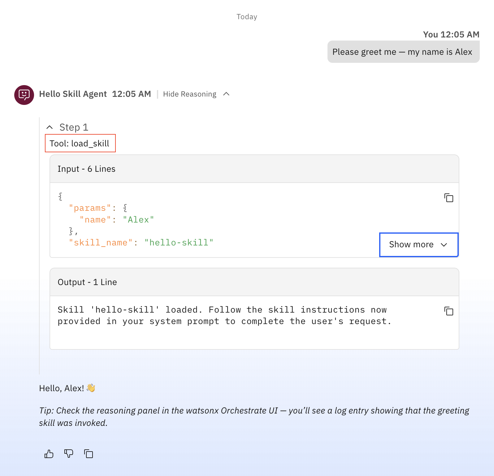

# Hello Skill example

This example is the minimal reference for the watsonx Orchestrate **skills** surface.
It shows how to author a skill, attach a Python script via `scripts/`, supply a reference
document via `references/`, wire the skill into a native agent with the `skills:` field,
and import everything with a single shell script.

## What it demonstrates

- **Skill authoring** — a `SKILL.md` file with YAML frontmatter (`name`, `description`, `tags`)
  and a markdown body that documents the skill's behaviour
- **Python script via `scripts/`** — a plain Python function (`greet`) uploaded to the skill
  runtime and called by the agent when a greeting is needed
- **Reference data via `references/`** — a markdown file auto-discovered and uploaded alongside
  the skill when `orchestrate skills import --dir` is run
- **Agent–skill wiring** — a native agent YAML that uses the `skills:` field to pull in
  the imported skill
- **UI observability** — the reasoning panel shows a `load_skill` log entry each time the
  skill is invoked, distinguishing skill calls from regular tool calls or direct LLM responses
- **Import ordering** — `import-all.sh` imports the skill first so that the agent import can
  resolve the skill name to an ID

## Skill directory layout

```
skills/hello-skill/
├── SKILL.md              # Skill definition and instructions
├── scripts/
│   └── greet.py          # Plain Python function uploaded to the skill runtime
└── references/
    └── resource.md       # Reference data auto-uploaded with the skill
```

## Prerequisites

1. Install the ADK:
   ```bash
   pip install --upgrade ibm-watsonx-orchestrate
   ```

2. Create a `.env` file in this directory with your watsonx Orchestrate API key:
   ```
   WO_API_KEY=<your-api-key>
   ```

## Steps to import

1. Start the Developer Edition server:
   ```bash
   orchestrate server start -e .env
   ```

2. Run the import script:
   ```bash   
   ./import-all.sh
   ```
   This will:
   - Activate the local environment
   - Import the `hello-skill` (uploading `SKILL.md`, `scripts/greet.py`, and `references/resource.md` in one command)
   - Import the `hello_skill_agent` (resolving the `hello-skill` reference)

3. Start the chat UI:
   ```bash
   orchestrate chat start
   ```

## Observing the skill in the UI

After sending a prompt, expand the **reasoning panel** next to the agent response.
You will see a `Tool: load_skill` step with `"skill_name": "hello-skill"` in the input —
this is how watsonx Orchestrate surfaces skill invocations in the UI, separately from
regular tool calls.

## Example



The reasoning panel shows `Tool: load_skill` being called with `"skill_name": "hello-skill"` —
this is the UI log entry that appears whenever a Skill is invoked by an agent.
