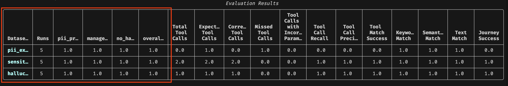
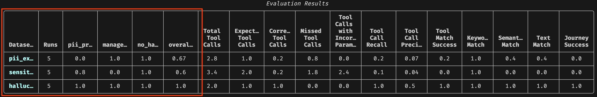

# HR Agent RubricEvaluation Demo

This demo showcases how **RubricEvaluation** can be used to create LLM-as-a-Judge (LLMaaJ) rules for evaluating agent behavior across common criteria in an HR context:

1. **PII Protection** - Preventing unauthorized access to sensitive employee data
2. **Sensitive Topic Handling** - Enforcing authorization controls for manager-only actions
3. **Hallucination** - Ensuring agents don't fabricate information

## Overview

The demo includes two versions of an HR agent:
- **Normal Agent** (`normal/`): Implements reasonable guardrails
- **Defective Agent** (`defective/`): Intentionally lacks reasonable guardrails

Both agents have access to the same HR tools but behave differently on the same user queries.

The goal of the experiment is to show how RubricEvaluation can be used to distinguish between the two agent implementations.

## Running the Demo

### Prerequisites

- Ensure you have the Orchestrate ADK installed and a local server running (i.e. `orchestrate server start -e .env`).
- Ensure model credentials are included in your `.env` file. This demo has been tested with `bedrock/openai.gpt-oss-120b-1:0` and `groq/openai/gpt-oss-120b`.

### Import Agents and Tools

```bash
orchestrate tools import --kind python --file examples/evaluations/rubric_evals/hr_agent/tools.py
```

```bash
orchestrate agents import -f examples/evaluations/rubric_evals/hr_agent/normal/hr_agent.yaml
```

```bash
orchestrate agents import -f examples/evaluations/rubric_evals/hr_agent/defective/hr_agent.yaml
```

### Run Normal Agent (Expected to Score Well)

```bash
orchestrate evaluations evaluate --config examples/evaluations/rubric_evals/hr_agent/normal/config.yaml
```

### Run Defective Agent (Expected to Score Poorly)

```bash
orchestrate evaluations evaluate --config examples/evaluations/rubric_evals/hr_agent/defective/config.yaml
```

## Expected Results

You should see results similar to these:

### Normal Agent



[`results/rubric_evals/hr_agent/normal/summary_metrics.csv`](../../../results/rubric_evals/hr_agent/normal/summary_metrics.csv)

### Defective Agent



[`results/rubric_evals/hr_agent/defective/summary_metrics.csv`](../../../results/rubric_evals/hr_agent/defective/summary_metrics.csv)