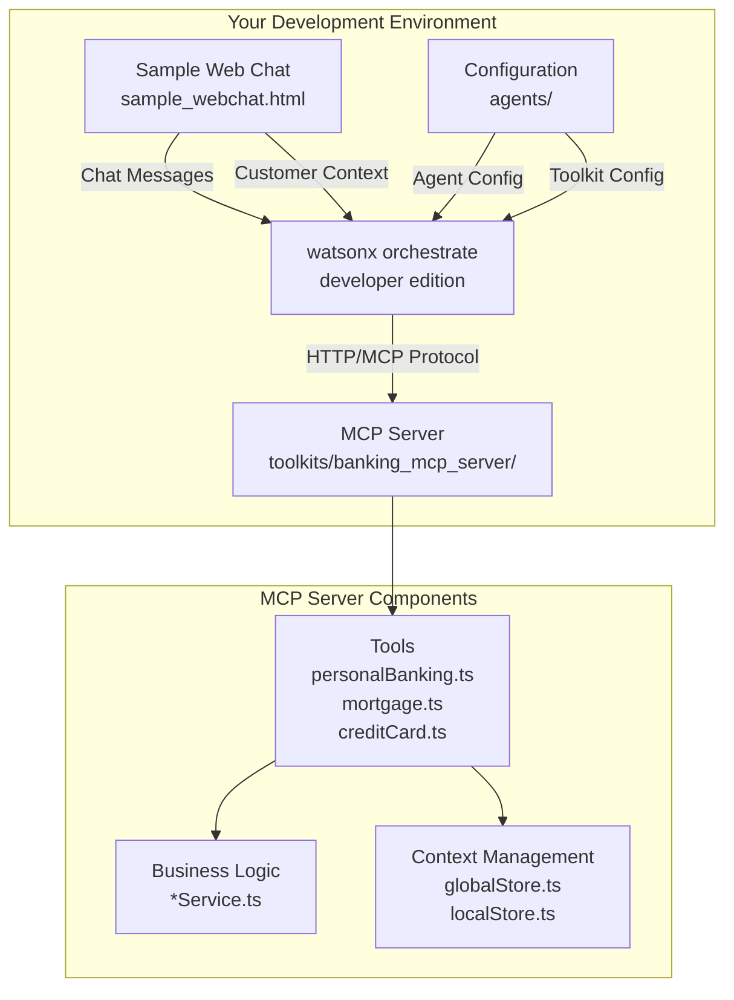

# Getting Started with CustomerCare

## What is CustomerCare?

CustomerCare is a technology demonstrator repository that showcases a new **Customer Care Agent (CCA)** style planned for Watson Orchestrate. This repository provides:

1. **A working MCP server** (`toolkits/banking_mcp_server/`) - A multi-step banking application demonstrating customer care patterns
2. **Comprehensive documentation** (`docs/`) - Patterns and best practices for building customer care agents
3. **Working examples** (`agents/`) - Complete agent configurations you can import and test
4. **Sample web chat interface** (`sample_webchat.html`) - A ready-to-use chat interface for testing your agent

## Purpose of This Repository

This repository serves multiple purposes:

### 1. Gather Feedback on the Customer Care Agent Style

The CCA style is an experimental approach to building customer care agents that emphasizes:

- **Fast response times** - Critical for voice channels where delays feel like dropped calls
- **Risk mitigation** - Eliminating hallucination risks in sensitive domains like banking
- **Personalized experiences** - Tailoring tools and interactions based on customer products
- **Rich interactions** - Using widgets that adapt to different channels (web, mobile, voice)
- **Multi-lingual support** - Seamless operation across languages
- **Multi-step workflows** - Complex tasks with confirmation and validation

### 2. Demonstrate MCP Server Patterns

The banking MCP server in `toolkits/banking_mcp_server/` demonstrates real-world patterns you'll need:

- **[Unique Tools Per User](../UniqueToolsPerUser.md)** - Different customers see different tools based on their products
- **[Tool Responses to Users](../ToolResponsesToUsers.md)** - Bypass the LLM for exact responses
- **[Hybrid Responses](../HybridResponses.md)** - Combine LLM flexibility with data accuracy
- **[Transactions](../Transactions.md)** - Two-step confirmation for sensitive operations
- **[Widgets](../Widgets.md)** - Rich, channel-adapted interactions with zero LLM latency
- **[Authentication](../Authentication.md)** - Secure customer identification and access control
- **[Welcome Tool](../WelcomeTool.md)** - Automatic conversation initialization
- **[Tool Chaining](../ToolChaining.md)** - Deterministic tool sequences for business logic
- **[Passing Context to Tools](../PassingContextToTools.md)** - Three layers of context management
- **[Agent Handoff](../Handoff.md)** - Seamless escalation to human agents
- **[Localization](../Localization.md)** - Multi-language support

### 3. Provide a Development Environment

The watsonx orchestrate developer edition with the sample web chat interface allows you to:

- Test your MCP servers locally using watsonx orchestrate developer edition
- Import agents and toolkits using the CLI
- Simulate different customer profiles and contexts
- Iterate quickly on tool implementations
- Validate widget behaviors in a real chat interface
- Debug authentication and context flows

## Architecture Overview



### Components Explained

**Sample Web Chat Interface**
- HTML-based chat interface
- Connects to watsonx orchestrate developer edition
- Configurable customer context (phone number, JWT token)
- Provides a realistic chat experience for testing

**watsonx orchestrate Developer Edition**
- Local instance of watsonx orchestrate
- Runs agents and manages MCP server connections
- Handles agent orchestration and tool execution
- Provides the runtime environment for testing

**MCP Server**
- Node.js/TypeScript application
- Implements the Model Context Protocol
- Provides tools (functions) the agent can call
- Manages customer context and state

**Configuration Files**
- **Agent YAML**: Defines agent behavior and instructions
- **Toolkit YAML**: Connects agent to MCP servers and defines tools

## Key Concepts

### The Customer Care Agent Style

Traditional conversational AI relies heavily on the LLM for everything. The CCA style takes a different approach:

**What the LLM Does:**
- Understands natural language intent
- Determines which tool to call
- Generates conversational responses when appropriate

**What Your Code Does:**
- Returns exact data that must not be hallucinated
- Provides rich widgets for structured interactions
- Enforces business rules and validation
- Manages authentication and authorization
- Controls transaction flows with explicit confirmation

This division of responsibility provides:
- **Speed**: Direct responses bypass LLM processing
- **Accuracy**: Critical data comes from your code, not the model
- **Control**: Business logic is deterministic, not probabilistic
- **Security**: Sensitive operations require explicit user confirmation

### MCP (Model Context Protocol)

MCP is an open protocol that allows AI applications to connect to external tools and data sources. Think of it as a standardized API for AI agents.

**Key MCP Concepts:**
- **Tools**: Functions the agent can call (like "get_account_balance")
- **Resources**: Data the agent can read (like account information)
- **Prompts**: Reusable templates for common interactions
- **Context**: Information passed to tools (authentication, user identity, etc.)

### Three Layers of Context

The repository demonstrates three distinct layers for passing context to tools:

1. **Context Variables** (per-request): JWT tokens, locale, channel info
2. **Global Store** (conversation-wide): Customer ID, permissions, tenant ID
3. **Local Store** (MCP server-specific): Pending transactions, workflow state

See [Passing Context to Tools](PassingContextToTools.md) for complete details.

## Understanding the Banking Example

The banking example (`toolkits/banking_mcp_server/`) demonstrates a realistic customer care scenario:

### Customer Profiles

The example includes four customer profiles with different product combinations:

- **CUST001**: Personal banking + Credit card
- **CUST002**: Personal banking + Mortgage
- **CUST003**: All products (personal banking, mortgage, credit card)
- **CUST004**: Personal banking only

### Dynamic Tool Availability

Each customer sees only tools relevant to their products:

```typescript
// CUST001 sees:
- Personal banking tools (balance, transfer, statement)
- Credit card tools (balance)
- Welcome tool (authentication)
- Handoff tool (escalation)

// CUST004 sees:
- Personal banking tools only
- Welcome tool
- Handoff tool
```

This personalization happens automatically based on the customer's product entitlements.

### Multi-Step Workflows

The money transfer flow demonstrates a complete multi-step workflow:

1. **Select source account** (widget: account picker)
2. **Select destination account** (widget: account picker, filtered)
3. **Select transfer date** (widget: date picker)
4. **Review and confirm** (widget: confirmation dialog)
5. **Execute or cancel** (based on user choice)

Each step uses widgets for optimal UX and performance, with zero LLM calls.

### Authentication Flow

The welcome tool demonstrates automatic authentication:

1. Agent starts conversation
2. Welcome tool automatically called
3. Customer enters PIN
4. System validates and stores customer ID
5. Tools refresh to show customer-specific options

## How to Use This Repository

### 1. Learn the Patterns

Start by reading the documentation in `docs/`:

- Begin with [Unique Tools Per User](../UniqueToolsPerUser.md) to understand personalization
- Read [Widgets](../Widgets.md) to learn about rich interactions
- Study [Transactions](../Transactions.md) for secure confirmation flows
- Explore other patterns as needed for your use case

### 2. Run the Example

Follow the [Installation Guide](Installation.md) to:

1. Install prerequisites (Node.js, watsonx orchestrate CLI)
2. Set up watsonx orchestrate developer edition
3. Set up and start the MCP server
4. Import the agent using `import-all.sh`
5. Open `sample_webchat.html` in your browser to test the agent

### 3. Experiment with Modifications

Try making changes to understand how things work:

- Modify tool descriptions in `toolkits/banking_mcp_server/src/personalBanking.ts`
- Add new tools following existing patterns
- Change widget configurations
- Test with different customer profiles in `sample_webchat.html`
- Adjust agent instructions in `agents/banking_agent.yaml`
- Re-import the agent using `import-all.sh` after making changes

### 4. Build Your Own

Use this repository as a template:

- Copy the structure for your domain
- Replace banking tools with your business logic
- Implement your authentication mechanism
- Create customer profiles for your products
- Configure the agent for your use case

See [Extending the Server](ExtendingTheServer.md) and [Creating New Servers](CreatingNewServers.md) for detailed guidance.

## What Makes This Different?

### Compared to Traditional Chatbots

Traditional chatbots rely on intent recognition and dialog trees. The CCA style uses:

- **Natural language understanding** via LLM
- **Dynamic tool selection** based on context
- **Flexible conversations** that adapt to user needs
- **Rich interactions** beyond text

### Compared to Generic AI Agents

Generic AI agents let the LLM do everything. The CCA style provides:

- **Controlled responses** for critical data
- **Explicit confirmations** for transactions
- **Performance optimization** via widgets
- **Channel adaptation** for voice, web, mobile
- **Risk mitigation** for regulated industries

### Compared to Watson Assistant

If you're familiar with Watson Assistant:

- **Actions** → **Tools** (but more flexible)
- **Dialog Skills** → **Agent Instructions** (but more natural)
- **Context Variables** → **Three-layer context system** (more powerful)
- **Webhooks** → **MCP Protocol** (standardized)

The CCA style is more agentic and flexible while maintaining the control and reliability needed for customer care.

## Quick Start

To get started quickly:

1. **Install watsonx orchestrate developer edition** - Follow the [Installation Guide](Installation.md)
2. **Start the MCP server** - Run the banking MCP server locally
3. **Import the agent** - Run `./import-all.sh` from the repository root
4. **Open the web chat** - Open `sample_webchat.html` in your browser
5. **Start chatting** - Test the banking agent with different customer scenarios

## Next Steps

1. **Install and run the demo** - [Installation Guide](Installation.md)
2. **Explore the code** - Start with `toolkits/banking_mcp_server/src/index.ts` and `toolkits/banking_mcp_server/src/personalBanking.ts`
3. **Read pattern documentation** - Focus on patterns relevant to your use case
4. **Experiment** - Modify the example to understand how it works
5. **Build your own** - Use this as a template for your domain

## Getting Help

- **Documentation**: Comprehensive guides in `docs/` and `docs/tutorials/`
- **Code Examples**: Working implementations in `toolkits/banking_mcp_server/src/`
- **Configuration Examples**: Sample agent and toolkit configs in `agents/` and `toolkits/`
- **Comments**: Detailed inline comments throughout the codebase

## Contributing Feedback

This is a technology demonstrator to gather feedback. We want to know:

- What patterns work well for your use cases?
- What's missing or unclear?
- What additional patterns would be valuable?
- How does the developer experience feel?
- What would make this easier to adopt?

Your feedback will shape how this style evolves and eventually integrates into Watson Orchestrate.