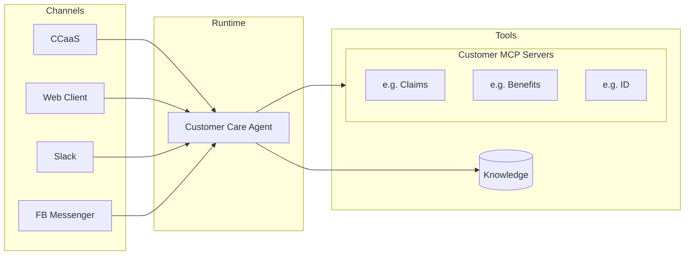

# Customer Care

## Quick Start

**New to this repository?** Start here:

1. **[Installation Guide](../../docs/tutorials/Installation.md)** - Set up the repository and run the banking demo
2. **[Getting Started](../../docs/tutorials/GettingStarted.md)** - Understand the purpose, architecture, and key concepts
3. **[Extending the Server](../../docs/tutorials/ExtendingTheServer.md)** - Add new tools and features to the banking example
4. **[Creating New Servers](../../docs/tutorials/CreatingNewServers.md)** - Build your own MCP server from scratch
5. **[Setting Up Knowledge](../../docs/tutorials/SettingUpKnowledge.md)** - Set up Knowledge for the banking demo

## Overview

This repository is a **technology demonstrator** for a new Customer Care Agent (CCA) style planned for Watson Orchestrate. It provides:

- **A working MCP server** (`src/`) - Multi-step banking application demonstrating customer care patterns
- **A text-based UI (TUI)** (`agent_runtime/`) - Simulator for testing and development
- **Comprehensive documentation** (`docs/`) - Patterns and best practices
- **Working examples** (`agent_runtime/examples/`) - Complete configurations you can run and modify

The CCA style emphasizes fast response times, risk mitigation, personalized experiences, rich interactions, and multi-step workflows optimized for customer care scenarios.

## Architecture

Watsonx Orchestrate provides a complete customer care solution. It contains an optimized, extensible customer care agent that can be tailored for your business. This agent comes pre-integrated to support the rich interactions that your customers demand on the channels you need to work with (e.g., CCaaS, Web Chat, Voice).

The overall architecture is shown below:

The agent is tailored to your business by uploading your content to its knowledge store and by providing MCP Servers that allow the agent to access your business systems on behalf of your customers.

The optimized customer care agent can provide the following qualities that are critical in the customer care domain:

- **Fast Response Times**: Delivering quick and efficient responses to customer inquiries
- **Risk Mitigation**: Reducing and in some cases eliminating the risk of incorrect hallucinated answers that could lead to liability issues in sensitive domains
- **Personalized Experience**: Tailors interactions based on services the customer has (e.g., Mortgage, Personal Banking)
- **Rich Interaction**: Use one of the many out-of-the-box widgets (e.g., Date Picker) or provide your own (e.g., airline seat picker)
- **Works in Multiple Languages**: You provide your business logic once, and the platform seamlessly allows the interactions in multiple languages
- **Multi-Step Task Execution**: Performing complex tasks that require multiple steps to complete and that could be long lived - TODO (this is sorta covered in widgets, but we may need to deal with long lived scenarios)

These qualities are accessible to your business by building MCP Servers that return the necessary instructions to the agent via the MCP protocol. This repo provides a sample MCP Server and documentation to get you started. It outlines how to accomplish many of the patterns commonly seen in the customer service domain. Some of these patterns are achieved via standard MCP practices, and some are leveraging Orchestrate-specific capabilities via MCP extensions. Orchestrate specific extensions are in the [specChanges](../../docs/specChanges) folder.

The remainder of this document is split into sections that introduce a pattern, outline why it is needed and then link to a specific example that outlines how to implement.

## Personalized Experiences

Your customers need different agent experiences. For example, a customer with both a mortgage and a checking account requires different support than a customer who only has a credit card. As such, the provided customer care agent must personalize the tools it uses for each specific customer. To allow this, the agent passes conversation context allowing your MCP Server to return tools applicable to the authenticated user. This allows the agent to tailor the experience by customer. See the [Unique Tools Per User](../../docs/UniqueToolsPerUser.md) documentation for a complete walkthrough.

## Risk Mitigation Strategies

There are many scenarios where you may not wish the LLM to provide the answer or to take unilateral action on the user's behalf.

Consider a simple question such as _"What is my current bank balance?"_ By default, the tool response containing the current balance goes to the LLM, and then the LLM generates a response to the user. While small, there is a non-zero chance that the LLM fails to correctly transcribe the bank balance, potentially resulting in liability. In some industries, the response to a question like this may be regulated. For example, in the UK, when a bank balance is returned, any outstanding transactions MUST also be displayed, and this is required by law.

The risks increase as the LLM is asked to do more. For example, consider the question _"How much did I spend on groceries last month?"_ Assuming there is a tool call that returns the transactions between certain dates and that each transaction has a category on it, we are now asking the LLM to appropriately filter the data and sum up a large number of values. The risk has now substantially increased for an incorrect answer. Again, depending on your domain and your risk tolerance, this may be acceptable. You may, however, want to prevent this.

Finally, there are transactions. When a user has asked to make a money transfer, the user should confirm the details of the transaction (e.g., that they are moving $100 from checking to savings). When they confirm, the exact transfer that they agreed to must take place. There can be no hallucination risk that the model can either change the details after the confirmation or that the model can call the transfer without explicit user confirmation.

Model instructions and hope are no way to run a business. The Watsonx Orchestrate agent provides a means to mitigate all of these risks. The required behavior is described via MCP (and its extensions), and the Watsonx Customer Care Agent provides the guarantees that businesses need to feel confident in their agent's behaviors.

The following patterns outline approaches to mitigate the above risks.

[Tool Responses to Users](../../docs/ToolResponsesToUsers.md) outlines how to have the tool return a response that will go directly to the user and that will not pass through the LLM. This is useful when a user response must be shown exactly as produced, for example, showing a bank balance in the UK and including any outstanding transactions.

[Hybrid Responses](../../docs/HybridResponses.md) demonstrates a means to have the model formulate part of the response while ensuring that parts of the answer come directly from your code. This provides for a more natural interaction while ensuring that the model cannot hallucinate incorrect data responses. This pattern is useful for questions such as _"How much did I spend on groceries last month?"_. The agent will politely refuse to calculate it (mitigating the hallucination risk) while providing the necessary data so that the customer can perform the calculation.

The [Transaction Pattern](../../docs/Transactions.md) addresses scenarios where customers are making changes that require explicit confirmation with a customizable dialog. This pattern ensures the model cannot automatically confirm transactions and that users must explicitly approve actions through UI interactions. This is essential for financial transactions, account changes, or any operation requiring explicit user consent for regulatory compliance or risk mitigation.

A summary of what the model sees and does not see is covered in [Model Visibility](../../docs/reference/ModelVisibility.md)

## Approaches to Reduce Latency (Very Important for Voice)

Latency is critical in customer care interactions, particularly for voice channels. When a customer asks a question over the phone, even a few seconds of silence can create a poor experience. Customers may think the call has dropped, become frustrated, or lose confidence in the service. In voice interactions, delays of 3-5 seconds can feel like an eternity and significantly impact customer satisfaction scores. The expectation for voice is near real-time responsiveness, similar to speaking with a human agent.

The Watsonx Orchestrate Customer Care agent is optimized for low latency through efficient context management and the use of faster, lightweight models. However, tool implementation plays a crucial role in overall response times and can significantly impact the end-user experience.

One effective approach to reduce latency is to bypass unnecessary LLM calls when returning information to users. The [Tool Responses to Users](../../docs/ToolResponsesToUsers.md) pattern demonstrates how tools can return responses that go directly to the user without passing through the LLM. This eliminates the round-trip time to the language model, which can save 1-3 seconds or more per interaction. This is particularly valuable for simple informational queries like checking account balances, retrieving order status, or looking up customer details where the tool can format a complete, accurate response without requiring LLM processing.

The [Hybrid Responses](../../docs/HybridResponses.md) pattern offers a middle ground: slower than direct tool responses but significantly faster than having the LLM process large datasets. While it requires an LLM call for the conversational wrapper, it avoids the token processing time for formatting structured data, making it ideal for data-heavy responses where a more natural interaction is desired.

The [Widget Pattern](../../docs/Widgets.md) represents the most powerful latency optimization technique, eliminating LLM calls both when presenting options to users and when processing their selections. By using interactive widgets with predefined options and simple matchers to validate user choices, this pattern delivers both maximum performance and rich user experiences that automatically adapt to different channels—including voice, where widgets prompt for spoken input and use speech recognition or DTMF for selection validation.

## Customizing the Interactions

While text-based question-and-answer interactions form the foundation of customer care, many interactions require structured input beyond free-form text e.g. selecting dates, choosing from predefined options, entering numeric values, or using domain-specific interfaces like seat selectors or floor plan pickers.

The Watsonx Orchestrate Customer Care agent provides rich, interactive widgets that automatically adapt to their channel. A date picker renders as a visual calendar on web/mobile but prompts for spoken input on voice channels. Numeric inputs can use DTMF on phone systems. This allows you to define interaction patterns once while delivering optimal experiences across all channels.

The [Widget Pattern](../../docs/Widgets.md) provides a comprehensive walkthrough of implementing widgets for both rich interactions and performance optimization. It covers IBM's built-in widgets (date pickers, account selectors, confirmation dialogs) and explains how customers can create custom widgets for domain-specific needs. See [Widget Response Types](../../docs/reference/WidgetResponseTypes.md) for a complete list of Orchestrate's included Widgets.

### Agent Handoff

Sometimes automated assistance isn't enough, and customers need to speak with a human agent. The [Agent Handoff Pattern](../../docs/Handoff.md) demonstrates how to implement a user-controlled handoff flow that gives customers the choice between real-time connection to a human agent or scheduling a callback. This pattern uses the `connect_to_agent` response type for real-time handoffs. The pattern ensures graceful handling of agent availability and preserves important context for human agents.

## Passing Context to Tools

Your MCP tools need access to critical contextual information to function properly—user identifiers, authentication tokens, tenant IDs, locale settings, and more. However, **the model cannot be trusted to reliably provide this data**. The model might forget parameters, transcribe values incorrectly, or be manipulated through prompt injection to access unauthorized data.

Consider a banking tool that retrieves account balances. If you rely on the model to pass the customer ID, a malicious user could potentially manipulate the conversation to access another customer's accounts. Similarly, authentication tokens, API keys, and other sensitive credentials should never flow through the model where they could be logged, cached, or exposed.

The solution is to **complement the data coming from the model with data from your application and its surrounding environment**. Your application knows who the authenticated user is, what permissions they have, which tenant they belong to, and what channel they're using. This trusted data must be injected into your tools through secure, controlled mechanisms that bypass the model entirely.

Watson Orchestrate provides three distinct layers for passing context to your MCP tools, each serving a different purpose:

**Context Variables (Per-Request)**: Data passed by the API caller that flows through to tools via `_meta`. Can be system-provided (by Orchestrate) or application-provided (by the caller). Examples: JWT tokens, locale, thread_id, channel information.

**Global Store (Conversation-Wide)**: Data stored at the conversation thread level that persists across all MCP servers within that thread. Examples: customer ID (after authentication), permissions, tenant ID.

**Local Store (MCP Server-Specific)**: Data stored per MCP server within a thread, providing the best encapsulation by isolating data per MCP server. Examples: pending transactions, multi-step operation state.

See [Passing Context to Tools](../../docs/PassingContextToTools.md) for complete details on when to use each layer, how to access them in your tools, and implementation examples.

## Authentication

Authentication is critical for ensuring tools access customer data securely. Watson Orchestrate supports two authentication approaches:

1. **Client Authentication (Recommended)**: Your application authenticates users before invoking the agent and passes credentials (like JWT tokens) as context variables. This is the recommended approach for most scenarios as it keeps authentication logic in your trusted application code.

2. **Agent Authentication**: The agent handles authentication during the conversation, such as collecting a PIN during a voice call. This is used for specific scenarios like voice channels or step-up authentication.

See [Authentication Patterns](../../docs/Authentication.md) for complete implementation details, including how to pass JWT tokens as context variables and use them in your tools.

## Welcome Tool

Many customer care applications need to initialize conversations automatically when they begin e.g. identifying customers, authenticating them, and establishing context before any explicit user request. The [Welcome Tool Pattern](../../docs/WelcomeTool.md) demonstrates how to implement automatic initialization workflows that run when a conversation thread starts.

This pattern uses the `welcomeTool: true` metadata flag to designate a tool for automatic invocation. When successful authentication occurs, the tool signals a global tool refresh using `refreshThreadCapabilities`, causing all MCP servers to update their available tools based on the authenticated customer's profile. This enables dynamic tool availability: before authentication, only welcome and handoff tools are visible; after authentication, product-specific tools become available automatically.

The pattern is essential for:
- Automatic customer identification and greeting
- Secure PIN-based authentication
- Seamless initialization without user prompts

## Tool Chaining

In many customer care scenarios, business logic dictates that one tool must automatically trigger another tool. For example, when a customer attempts to transfer money from a locked account, the system should automatically initiate an agent handoff without relying on the LLM to interpret instructions.

The [Tool Chaining Pattern](../../docs/ToolChaining.md) demonstrates how to use the `_meta.nextTool` field to create deterministic tool chains. When a tool determines another tool must be called next, it explicitly specifies the tool name and arguments in its response metadata.

This pattern is essential for workflows like automatic escalations, error recovery, approval chains, and any scenario where business rules require specific tool sequences.

## Multi-Lingual Support

Watson Orchestrate provides comprehensive multi-lingual support. The model automatically localizes content that passes through it, but when your tools send content directly to users (via `audience: ['user']` or widgets), you must implement localization yourself.

The [Localization](../../docs/Localization.md) guide explains:

- When the model handles localization automatically vs. when you need to implement it
- How to access the user's locale from system context variables
- Template-based localization patterns with a complete example

## Getting Started

Ready to build your own customer care agent? Follow these guides:

1. **[Installation Guide](../../docs/tutorials/Installation.md)** - Install prerequisites and run the banking demo
2. **[Getting Started](../../docs/tutorials/GettingStarted.md)** - Understand the architecture and key concepts
3. **[Extending the Server](../../docs/tutorials/ExtendingTheServer.md)** - Add new tools to the banking example
4. **[Creating New Servers](../../docs/tutorials/CreatingNewServers.md)** - Build your own MCP server from scratch
5. **[Setting Up Knowledge](../../docs/tutorials/SettingUpKnowledge.md)** - Set up Knowledge for the banking demo

## Knowledge

In many customer care scenarios, the agent often needs to answer customer questions from predefined content. 

The [Knowledge Pattern](../../docs/KnowledgeTool.md) demonstrates how to use a vector store to provide content grounded answers to customer questions. This guide explains:

- How to setup OpenSearch as a vector store
- How to create a vector index
- How to ingest predefined content into the vector store
- How to search the vector store for content grounded answers

## Documentation Index

### Tutorials
- [Installation Guide](../../docs/tutorials/Installation.md) - Setup and running the demo
- [Getting Started](../../docs/tutorials/GettingStarted.md) - Repository purpose and architecture overview
- [Extending the Server](../../docs/tutorials/ExtendingTheServer.md) - Adding features to the banking example
- [Creating New Servers](../../docs/tutorials/CreatingNewServers.md) - Building new MCP servers from scratch
- [Setting Up Knowledge](../../docs/tutorials/SettingUpKnowledge.md) - Setting up Knowledge for the demo

### Core Patterns
- [Unique Tools Per User](../../docs/UniqueToolsPerUser.md) - Personalize tools based on customer products
- [Tool Responses to Users](../../docs/ToolResponsesToUsers.md) - Bypass LLM for exact responses
- [Hybrid Responses](../../docs/HybridResponses.md) - Combine LLM flexibility with data accuracy
- [Transactions](../../docs/Transactions.md) - Two-step confirmation for sensitive operations
- [Widgets](../../docs/Widgets.md) - Rich, channel-adapted interactions
- [Authentication](../../docs/Authentication.md) - Secure customer identification
- [Welcome Tool](../../docs/WelcomeTool.md) - Automatic conversation initialization
- [Tool Chaining](../../docs/ToolChaining.md) - Deterministic tool sequences
- [Agent Handoff](../../docs/Handoff.md) - Escalation to human agents
- [Localization](../../docs/Localization.md) - Multi-language support
- [Knowledge](../../docs/KnowledgeTool.md) - Knowledge support

### Advanced Topics
- [Passing Context to Tools](../../docs/PassingContextToTools.md) - Three layers of context management
- [Model Visibility](../../docs/reference/ModelVisibility.md) - What the model sees and doesn't see
- [Widget Response Types](../../docs/reference/WidgetResponseTypes.md) - Complete widget reference
- [Context Reference](../../docs/reference/Context.md) - System and customer context variables

### MCP Extensions
- [Global Tool Refresh Metadata](../../docs/specChanges/GlobalToolRefreshMetadata.md)
- [Multiple Widgets Per Tool](../../docs/specChanges/MultipleWidgetsPerTool.md)
- [Tool Chaining Metadata](../../docs/specChanges/ToolChainingMetadata.md)
- [Welcome Tool Metadata](../../docs/specChanges/WelcomeToolMetadata.md)

## Contributing Feedback

This is a technology demonstrator to gather feedback on the Customer Care Agent style. We want to know:

- What patterns work well for your use cases?
- What's missing or unclear in the documentation?
- What additional patterns would be valuable?
- How does the developer experience feel?
- What would make this easier to adopt?

Your feedback will shape how this style evolves and eventually integrates into Watson Orchestrate.

## Future Enhancements

Areas we're exploring for future development:

- Multi-Agent / Multi-MCP Server Architectures
- Long-lived task management
- Migration guides for Watson Assistant users
- Additional widget types and customization options
