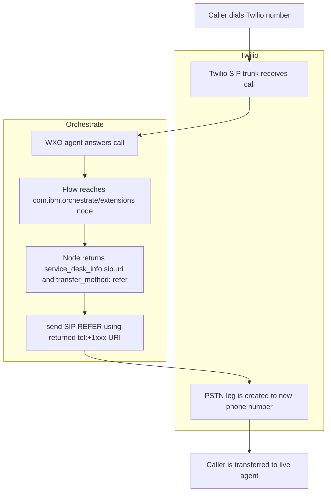

# Agent with Transfer to live via SIP

## Setting up Twilio SIP 

Prerequisite:
[setting up Twilio SIP with your agent](https://www.ibm.com/docs/en/watsonx/watson-orchestrate/base?topic=trunk-configuring-tenant-id-service-providers#agent-builder-phone-sip-confiure-tenant__confiure-sip-tenant-twilio__title__1)

After this, you should be able to do a phone call to the Twilio number you bought, and hear responses from your agent.

## Transferring to another phone

Transferring to a live agent works like this:



On Twilio, you'll need to set the following properties:
Look for the section `General` -> `Features` -> `Call Transfer` on your SIP configuration.
1. `enable` SIP REFER
2. `enable PSTN Transfer`
3. click save


Inside your `com.ibm.orchestrate/extensions` Agentic Flow node in Orchestrate Flow Builder, you should see:

`sip.uri` is the phone number that will be called when this node is triggered. [You can read more about this on the Twilio docs](https://www.twilio.com/docs/sip-trunking/call-transfer#call-transfer-to-the-pstn)
```python
"service_desk_info": {
    "sip": {
        "uri": "tel:+1xxx",
        "transfer_method": "refer"
    }
}
```

## Speaking to the agent

The Agent handles "booking a hotel room".

Say something like "I want to book a room for 2 in Springfield for 2 nights starting June 10th"

you should hear "transferring you to a live agent" and your transfer number should receive a phone call.
