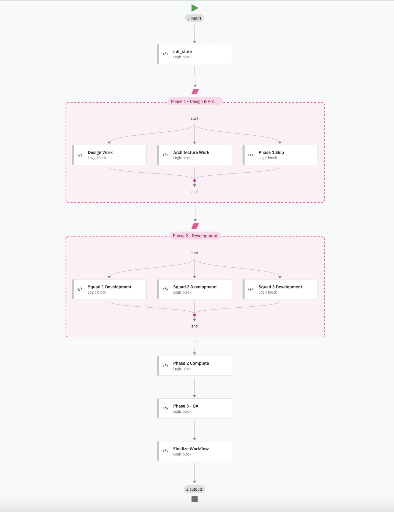

# Parallel Flow Example - Feature Delivery Workflow

This example demonstrates the use of parallel flows with conditional and unconditional execution in a feature delivery scenario.

## Overview

The workflow implements a three-phase feature delivery process:

1. **Phase 1: Design & Architecture** (Conditional Parallel)
   - Uses `parallel_conditions()` to conditionally execute design and/or architecture work
   - Conditions check whether design or architecture or both are needed
   - Includes a default case for when neither is needed
   - Demonstrates: **Conditional parallel execution**

2. **Phase 2: Development** (Unconditional Parallel)
   - Uses `parallel()` with no evaluator for unconditional parallel execution
   - Three squads work simultaneously on development
   - All paths always execute
   - Demonstrates: **Unconditional parallel execution**

3. **Phase 3: QA** (Sequential)
   - Traditional sequential execution after all parallel work completes
   - Demonstrates: **Integration with sequential flows**

## Workflow Structure



*The workflow shows three phases: Phase 1 (Design & Architecture) with conditional parallel execution, Phase 2 (Development) with unconditional parallel execution by three squads, and Phase 3 (QA) with sequential execution.*

## Key Features Demonstrated

### 1. Conditional Parallel Execution (`parallel_conditions()`)

```python
phase1_parallel = flow.parallel_conditions(
    name="parallel_phase1",
    display_name="Phase 1 - Design & Architecture"
)

phase1_parallel.condition(
    expression="flow.private.design_needed is True",
    to_node=design_work
).condition(
    expression="flow.private.arch_needed is True",
    to_node=architecture_work
).condition(
    default=True,
    to_node=phase1_skip
)
```

### 2. Unconditional Parallel Execution (`parallel()`)

```python
phase2_parallel = flow.parallel(
    evaluator=None,  # No evaluator means all paths execute
    name="parallel_phase2",
    display_name="Phase 2 - Development"
)

# All squads execute in parallel
phase2_parallel.sequence(START, squad1_work, END)
phase2_parallel.sequence(START, squad2_work, END)
phase2_parallel.sequence(START, squad3_work, END)
```

## Running the Example

### Option 1: Run Locally

```bash
# From the project root
python -m examples.flow_builder.parallel_flow.main
```

This will run three test cases:
1. Both design and architecture needed
2. Only design needed
3. Neither design nor architecture needed (skip Phase 1)

### Option 2: Import and Use with Agent

```bash
# Import the flow and agent
cd examples/flow_builder/parallel_flow
./import-all.sh

# Chat with the agent
orchestrate chat feature_delivery_agent
```

Then ask the agent to execute the workflow:
```
Execute the feature delivery workflow for a new "User Authentication" feature 
that needs both design and architecture work.
```

## Files

- **`tools/parallel_flow.py`** - The main workflow implementation
- **`main.py`** - Standalone test script with multiple test cases
- **`agents/feature_delivery_agent.yaml`** - Agent configuration
- **`import-all.sh`** - Script to import flow and agent
- **`generated/`** - Output directory for generated flow specifications

## Input Schema

```python
class FlowInput(BaseModel):
    feature_name: str          # Name of the feature to deliver
    design_needed: bool        # Whether design work is needed
    arch_needed: bool          # Whether architecture work is needed
```

## Output Schema

```python
class FlowOutput(BaseModel):
    status: str                # Final status message
    phases_completed: List[str] # List of completed phases
```

## Learning Points

1. **Conditional Parallel**: Use `parallel_conditions()` when you need to conditionally execute parallel branches based on expressions
2. **Unconditional Parallel**: Use `parallel()` with no evaluator when all branches should always execute
3. **Default Case**: Use `condition(default=True, to_node=...)` for the "else" case
4. **Fluent API**: Chain multiple `condition()` calls for clean, readable code
5. **Integration**: Parallel flows integrate seamlessly with sequential flow elements

## Comparison: Branch vs Parallel

| Feature | Branch | Parallel |
|---------|--------|----------|
| Execution | First matching condition only | ALL matching conditions |
| Use Case | Exclusive paths (if-else) | Concurrent execution |
| Method | `conditions()` | `parallel_conditions()` |
| Semantics | Sequential evaluation | Concurrent evaluation |

## Next Steps

- Modify the workflow to add more phases
- Add error handling and retry logic
- Integrate with real tools and APIs
- Add more complex conditional logic
- Experiment with nested parallel flows