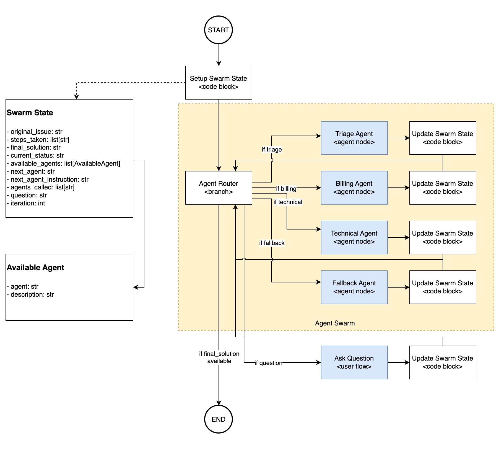

### Issue Triage workflow with Agent Swarm Pattern

1. Run `import-all.sh` 
2. Launch the Chat UI with `orchestrate chat start`
3. Pick the `customer_service_agent`
5. Type in something like `What is my current subscription status? my customer id is ABC123.`
   1. This will call the `triage_agent` followed by the `billing_agent`
   2. As there are multiple agents being called, the flow might take a while to run.
6. Type in something like `I want to remove my subscription? my customer id is ABC123.`
   1. This will call the `triage_agent` followed by the `billing_agent`
   2. The `billing_agent` will try to remove the subscription. However, there is a 90% change that it will fail.
   3. The `billing_agent` will delegate the call to the `technical_agent`.
   4. The `technical_agent` will diagnose the issue and it won't be able to resolve it. (as this is just a simulation)
   5. Either the `technical_agent` will delegate the call to the `fallback_agent` or the it will just response with a message that it cannot resolve the issue.
   6. As there are multiple agents being called, the flow might take a while to run.
7. Other scenario to try:
   1. `I want to check my subscription` - the billing_agent would generate a question to ask for customer id.  you will have to answer the question in the chat window.  NOTE: this example will only work when running the customer_service_agent through the Chat UI.
   2. `I want to check my subscription, my customer id is ABC123` - the billing_agent would check the status and return it right away.

### Testing Flow programmatically
1. Set `PYTHONPATH=<ADK>/src:<ADK>`  where `<ADK>` is the directory where you downloaded the ADK.
2. Run `python3 main.py`

### Swarm Pattern Explained

The **Swarm Pattern** is a multi-agent orchestration strategy where a group of specialized agents collaborate to handle complex tasks. Instead of relying on a single orchestrator/supervisor agent to delegate tasks, the swarm distributes responsibilities across multiple agents in a peer-to-peer settings, allowing agents to delegate to each others until the request goal is reached.

#### Purpose of this example
- **Fault Tolerance:** If one agent fails, another can take over.
- **Domain Specialization:** Each agent focuses on a specific area for better accuracy.
- **Dynamic Collaboration:** Agents delegate tasks based on context.
- **Iteration Control:** Prevents infinite loops by limiting retries.  It is not uncommon for swarm pattern to get into infinitie loops, so we added an iteration count to prevent this.

#### Example
This example uses the **watxons Orchestrate ADK** to create a swarm with four agents using wxO Agentic Workflow:

1. **`triage_agent`** – Entry point; routes requests to the right domain agent.
2. **`billing_agent`** – Handles billing issues.
3. **`technical_agent`** – Handles technical issues.
4. **`fallback_agent`** – Always last; returns an error and terminates the flow.

The flow starts with `triage_agent`, delegates to billing or technical, and ends with `fallback_agent` if unresolved.  
An **iteration count** in `SwarmState` ensures the flow doesn’t loop indefinitely.

#### Limitations
- **Complexity:** Adds orchestration overhead for simple tasks.  A swarm can become very complex easily as it rely on individual agents to decide what to do next.
- **Performance:** Extra delegation steps can slow down workflows.
- **Maintenance:** Updating agents requires careful logic changes.
- **Not Predictable:** Since we rely on individual agents to decide what to do next, the flow can behave unpredictably.

#### Not Ideal For
- Single-domain tasks  
- Real-time or low-latency operations (i.e. sending requests through multiple agents can take a while)
- Predictable workflows  

#### When to Use
- Tasks spanning multiple domains
- Scenarios requiring goal-based resilience and can live with some unpredictability.

### Why choose **wxO Agentic Workflow** for building an Agentic Swarm instead of using LangGraph?

- **Seamless human-in-the-loop integration**  
  wxO provides built-in support for user activities and forms, making it easy to incorporate human oversight and interaction into your swarm design.

- **Greater flexibility in agent composition**  
  With wxO, you can create swarms using agents built on different frameworks or technologies. LangGraph assumes all agents are defined within the same graph, which limits their portability and reuse in other contexts.

- **Enhanced control and predictability**  
  Agentic Workflow allows you to introduce a custom Agent Router as a control point, giving you fine-grained control. (e.g. prevent infinite agent delegation)

